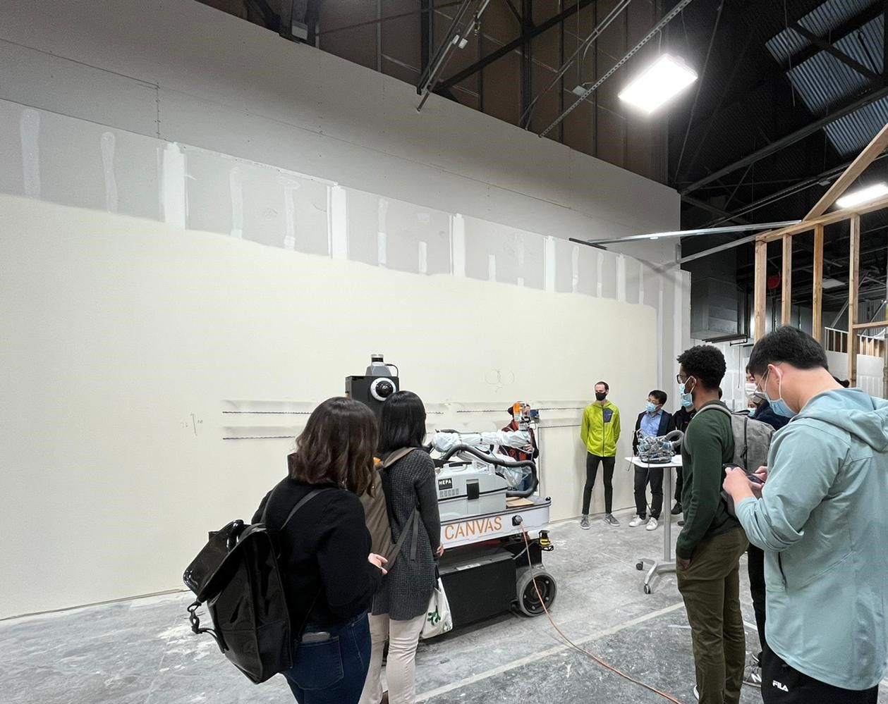
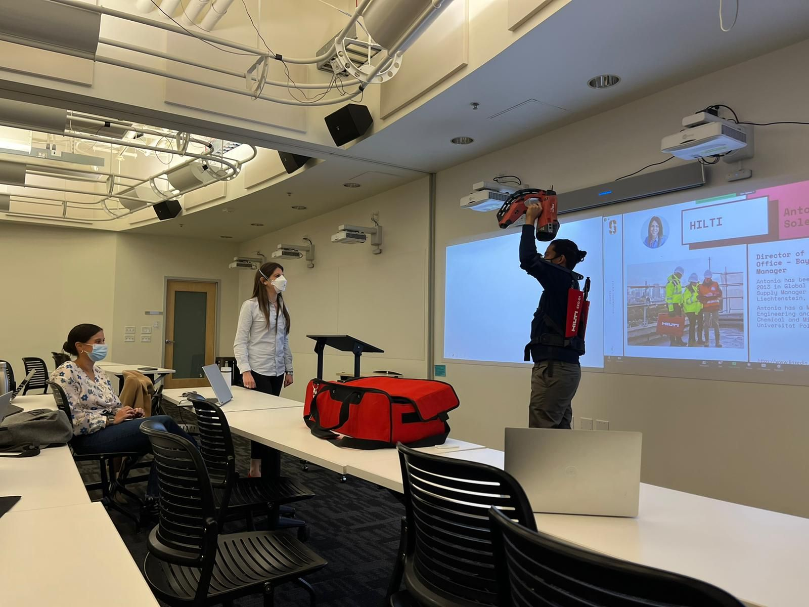
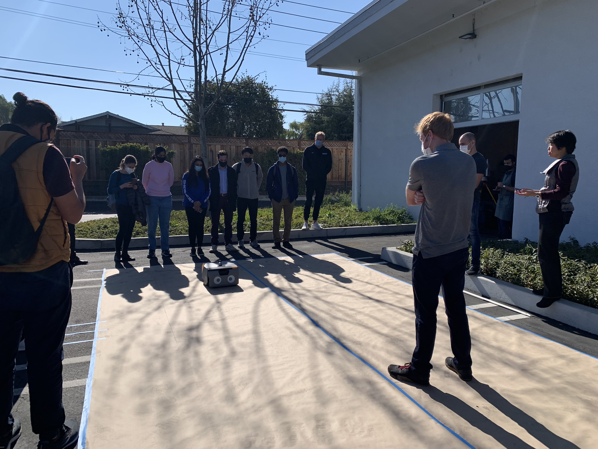

  

    
  

  

    
  

  

    
  

Advances in technologies, such as sensing, positioning, and computing, combined with Building Information Models (BIM) enable the use of robots in unstructured environments like construction. Class sessions contrast the development of construction robots with manufacturing robots, showcase the application of construction robots to at least ten tasks, such as drilling, painting, layout, bricklaying, etc., and introduce the Robotics Evaluation Framework (REF). The small-group class project carried out with industry partners applies the REF to compare the health and safety, quality, schedule, and cost performance of robotic and traditional construction methods.

        
 
        <a href="https://explorecourses.stanford.edu/search?view=catalog&filter-coursestatus-Active=on&page=0&catalog=&q=CEE+327%3A+Construction+Robotics&collapse=">Course Explore</a>
        

        

          <a href="https://docs.google.com/document/d/1axCw7F6pt2tsJFUtcZH08e5YE9dmQM756-3l2wxinf4/edit?usp=sharing">Syllabus</a>
        

    

 
<iframe width="545" height="300" src="https://www.youtube.com/embed/oaNdo6wDjbM" title="YouTube video player" frameborder="0" allow="accelerometer; autoplay; clipboard-write; encrypted-media; gyroscope; picture-in-picture" allowfullscreen>
</iframe>
 

### Schedule Spring 2023

(TBC) Tuesday (in person Room 292A) / Thursdays (online) 11:30 - 13:00 PT  
3 Units: Letter (ABCD/NC)  

### Course Instructors

&nbsp;&nbsp;&nbsp;&nbsp;&nbsp;&nbsp;&nbsp;&nbsp;&nbsp;&nbsp;&nbsp;&nbsp;&nbsp;

[Cynthia Brosque](https://www.linkedin.com/in/cbrosque/)&nbsp;&nbsp;&nbsp;&nbsp;&nbsp;&nbsp;&nbsp;&nbsp;&nbsp;&nbsp;&nbsp;&nbsp;&nbsp;&nbsp;&nbsp;&nbsp;&nbsp;&nbsp;&nbsp;&nbsp;[Martin Fischer](https://www.linkedin.com/in/martin-fischer-5b314)

PhD CEE/Adjust Professor &nbsp;&nbsp; Kumagai Professor School of Engineering

### Expected Learning Outcomes

- Contrast manufacturing and construction
- Evaluate the readiness of promising construction robots with a consistent Robotics Evaluation Framework
- Gain state-of-the-art robotics knowledge
- Collaborate directly with the industry partners driving construction robotization

### Previous Industry Partners

[Safety, quality, schedule, and cost impacts of ten construction robots](https://link.springer.com/article/10.1007/s41693-022-00072-5) 
[The robots are coming](https://podcasts.apple.com/us/podcast/the-robots-are-coming/id1522789533?i=1000568254125) 
[Research Presentations](https://linktr.ee/cbrosque) 

### Interested in Participating?

Please fill out this [survey](https://forms.gle/VFgrKs297nNJDwcS9)

Questions? cbrosque@stanford.edu

<!-- https://docs.github.com/en/github/writing-on-github/getting-started-with-writing-and-formatting-on-github/basic-writing-and-formatting-syntax -->

