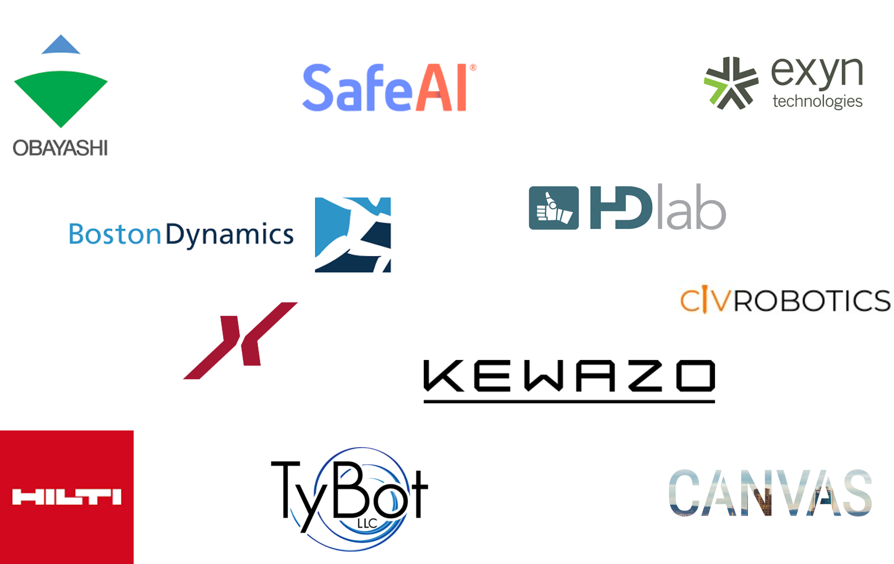

## CEE 327: Construction Robotics

Advances in technologies, such as sensing, positioning, and computing, combined with Building Information Models (BIM) enable the use of robots in unstructured environments like construction. Class sessions contrast the development of construction robots with manufacturing robots, showcase the application of construction robots to at least ten tasks, such as drilling, painting, layout, bricklaying, etc., and introduce the Robotics Evaluation Framework (REF). The small-group class project carried out with industry partners applies the REF to compare the health and safety, quality, schedule, and cost performance of robotic and traditional construction methods.

[Course Explore](https://explorecourses.stanford.edu/search?view=catalog&filter-coursestatus-Active=on&page=0&catalog=&q=CEE+327%3A+Construction+Robotics&collapse=)

3 Units: Letter (ABCD/NC)

### Course Instructors

Cynthia Brosque

PhD Candidate Civil and Environmental Engineering

cbrosque@stanford.edu - [Linkedin](https://www.linkedin.com/in/cbrosque/)

Martin Fischer

Kumagai Professor in the School of Engineering

Senior Fellow at the Precourt Institute for Energy

Civil and Environmental Engineering

fischer@stanford.edu - [Linkedin](https://www.linkedin.com/in/martin-fischer-5b314/)

### Schedule Winter 2022

Tuesday/Thursdays 11:30 am - 13:00 pm (PT)

Tuesday: in-person Room 292A

Thursday: online

### Expected Learning Outcomes

- Contrast manufacturing and construction
- Evaluate the readiness of promising construction robots with the Robotics Evaluation Framework
- Gain state-of-the-art robotics knowledge
- Collaborate directly with the industry partners driving construction robotization

### Interested in Participating?

Fill out this [survey] (https://forms.gle/VFgrKs297nNJDwcS9)

Research and class suported by CIFE, Stanford

<!-- https://docs.github.com/en/github/writing-on-github/getting-started-with-writing-and-formatting-on-github/basic-writing-and-formatting-syntax -->

